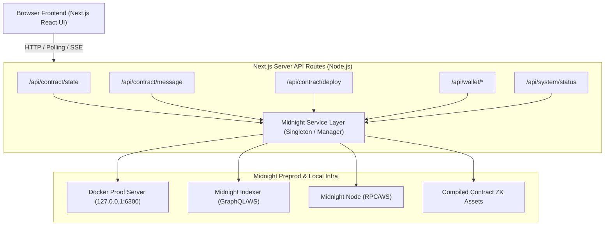

# Next.js Full-Stack Web Application for Midnight Hello World Contract

This implementation plan outlines the architecture, features, and steps to build a complete, state-of-the-art **Next.js web application** powered by the logic in [`src/cli.ts`](file:///home/paul/compact/hello-word/src/cli.ts) and [`src/deploy.ts`](file:///home/paul/compact/hello-word/src/deploy.ts).

---

## 1. Analysis of `cli.ts` and Core Midnight Logic

From analyzing [`src/cli.ts`](file:///home/paul/compact/hello-word/src/cli.ts), [`src/deploy.ts`](file:///home/paul/compact/hello-word/src/deploy.ts), and the Compact contract [`contracts/hello-world.compact`](file:///home/paul/compact/hello-word/contracts/hello-world.compact):

1. **Network & Configuration**:
   - Targets the **Midnight Preprod** network (`networkId: 'preprod'`).
   - Connects to Indexer GraphQL (`https://indexer.preprod.midnight.network/api/v4/graphql`), WebSocket (`wss://...`), RPC node, and local Zero-Knowledge Proof Server (`http://127.0.0.1:6300`).
2. **Cryptographic Key & Wallet Management**:
   - Derives role-based keys from a 32-byte (64 hex characters) seed: `Roles.Zswap` (Shielded), `Roles.NightExternal` (Unshielded Bech32), and `Roles.Dust` (Dust generation).
   - Initializes `WalletFacade` and syncs with the Midnight ledger to compute live tNIGHT and DUST balances.
   - Registers unshielded UTXOs for DUST generation to pay transaction fees.
3. **ZK & Ledger Providers**:
   - `NodeZkConfigProvider`: Loads compiled contract artifacts (`zkir`, proving keys, verification keys).
   - `httpClientProofProvider`: Communicates with the Proof Server container (`127.0.0.1:6300`) to generate zk-SNARK proofs.
   - `indexerPublicDataProvider`: Fast querying of on-chain public state (`HelloWorld.ledger(state.data).message`).
   - `levelPrivateStateProvider`: Manages private transaction states.
4. **Contract Circuits**:
   - `queryContractState`: Public read of the on-chain message.
   - `storeMessage(message)`: Provable circuit transaction that creates a ZK proof, balances with DUST/shielded keys, and submits to the ledger.
   - `deployContract`: Deploys a new instance of the contract and saves metadata to `deployment.json`.

---

## 2. Next.js Web Application Architecture

We will create a modern, high-performance Next.js application (App Router) styled with sleek Dark/Midnight glassmorphism aesthetics and dynamic animations.

### System Architecture Overview

---

## 3. Key Features of the Web Application

1. **Live On-Chain Message Board & Inspector**:
   - Real-time display of the current decentralized message on Midnight Preprod.
   - Contract address with copy-to-clipboard, quick link to explorer, and block sync badge.
   - Live status indicator showing when the message was last updated on-chain.

2. **Zero-Knowledge Message Publisher**:
   - Clean, intuitive input to submit new messages to the smart contract.
   - Visual multi-step progress indicator:
     1. Generating Zero-Knowledge Proof (via Proof Server)
     2. Balancing Transaction (with DUST tokens)
     3. Submitting to Midnight Ledger
     4. Confirmed in Block (with Transaction Hash and Block Height)

3. **Integrated Wallet Studio**:
   - Connect using an existing 64-character seed or 1-click **Generate New Random Wallet**.
   - Bech32 Address display with one-click copy & QR code.
   - Live token metrics: **tNIGHT balance** and real-time **DUST balance**.
   - Direct link to the official Midnight Preprod Faucet.
   - One-click **"Register for DUST Generation"** button for newly funded wallets.

4. **Contract Deployment Hub**:
   - Ability to deploy a new contract directly from the web interface.
   - Instant switching between custom contract addresses or the default deployed contract in `deployment.json`.

5. **Visual Interactive Web CLI / Terminal**:
   - Built-in terminal emulator component providing the full interactive CLI experience directly in the browser (running commands like `status`, `read`, `store <msg>`, `balance`, `deploy`, `help`).

6. **System & Health Monitor**:
   - Live status of Proof Server (`127.0.0.1:6300`), Indexer GraphQL, and Preprod network connectivity.

---

## 4. Proposed Changes & File Structure

### Dependencies & Setup
- Install `next`, `react`, `react-dom`, `lucide-react`, `clsx`, `tailwind-merge` (or vanilla CSS custom design tokens).
- Configure `next.config.mjs` to properly support Node.js native modules and WebAssembly/top-level await for the Midnight SDK.

### File Plan

#### [NEW] [src/lib/midnight-service.ts](file:///home/paul/compact/hello-word/src/lib/midnight-service.ts)
Core backend service module encapsulating:
- Wallet lifecycle and singleton session management.
- Provider factory (`indexerPublicDataProvider`, `httpClientProofProvider`, `levelPrivateStateProvider`, `NodeZkConfigProvider`).
- Methods: `getContractState(address)`, `storeMessage(seed, message, address)`, `deployNewContract(seed)`, `getWalletInfo(seed)`, `registerDust(seed)`, `getSystemHealth()`.

#### [NEW] [app/api/contract/state/route.ts](file:///home/paul/compact/hello-word/app/api/contract/state/route.ts)
Route handler to fetch the latest public contract state and decoded message.

#### [NEW] [app/api/contract/message/route.ts](file:///home/paul/compact/hello-word/app/api/contract/message/route.ts)
Route handler to execute the `storeMessage` circuit transaction.

#### [NEW] [app/api/contract/deploy/route.ts](file:///home/paul/compact/hello-word/app/api/contract/deploy/route.ts)
Route handler to deploy a fresh Hello World contract instance on Preprod.

#### [NEW] [app/api/wallet/status/route.ts](file:///home/paul/compact/hello-word/app/api/wallet/status/route.ts)
Route handler to derive wallet address and stream/poll balance & sync state.

#### [NEW] [app/api/wallet/register-dust/route.ts](file:///home/paul/compact/hello-word/app/api/wallet/register-dust/route.ts)
Route handler to register unshielded UTXOs for DUST generation.

#### [NEW] [app/api/system/status/route.ts](file:///home/paul/compact/hello-word/app/api/system/status/route.ts)
Route handler to check health of local proof server and Midnight indexer.

#### [NEW] [app/layout.tsx](file:///home/paul/compact/hello-word/app/layout.tsx) & [app/globals.css](file:///home/paul/compact/hello-word/app/globals.css)
Root layout and rich Midnight dark theme styling with glowing gradients, glass panels, modern typography, and smooth transitions.

#### [NEW] [app/page.tsx](file:///home/paul/compact/hello-word/app/page.tsx) & UI Components:
- `components/Header.tsx`: Navigation, network badge, proof server status, wallet summary.
- `components/MessageBoard.tsx`: Hero card showing on-chain message, refresh animation, and history.
- `components/MessageForm.tsx`: Interactive transaction submission with stage-by-stage visualizer.
- `components/WalletCard.tsx`: Seed manager, Bech32 address, tNIGHT & DUST balances, faucet button.
- `components/ContractManager.tsx`: Contract address selector & deployment modal.
- `components/WebTerminal.tsx`: Visual CLI interactive terminal emulator.
- `components/SystemStatus.tsx`: Network & container connectivity badges.

#### [MODIFY] [package.json](file:///home/paul/compact/hello-word/package.json)
Add Next.js scripts (`"dev": "next dev"`, `"build": "next build"`, `"start": "next start"`) and necessary dependencies.

---

## 5. Verification Plan

### Automated & Build Verification
1. **Next.js Build Check**:
   - Run `npm run build` / Next.js compilation to ensure zero TypeScript or bundling errors.
2. **API Endpoint Testing**:
   - Test `GET /api/contract/state` using `curl` or automated fetch to verify reading the deployed contract message `7cf30a5f13644e109d7374fe0529f8e4cddc6ee0d4a6eb3013ad6fe291e9c3d9`.
   - Test `GET /api/system/status` to verify proof server (`127.0.0.1:6300`) and indexer connectivity.

### Live UI & End-to-End Verification
1. Start the Next.js development server on port 3000.
2. Verify browser rendering, responsive design, wallet connection with existing seed from `deployment.json`, live DUST / tNIGHT balance display, and on-chain message reading.
3. Test publishing a message on Midnight Preprod and watch the live transaction status update until block confirmation.
