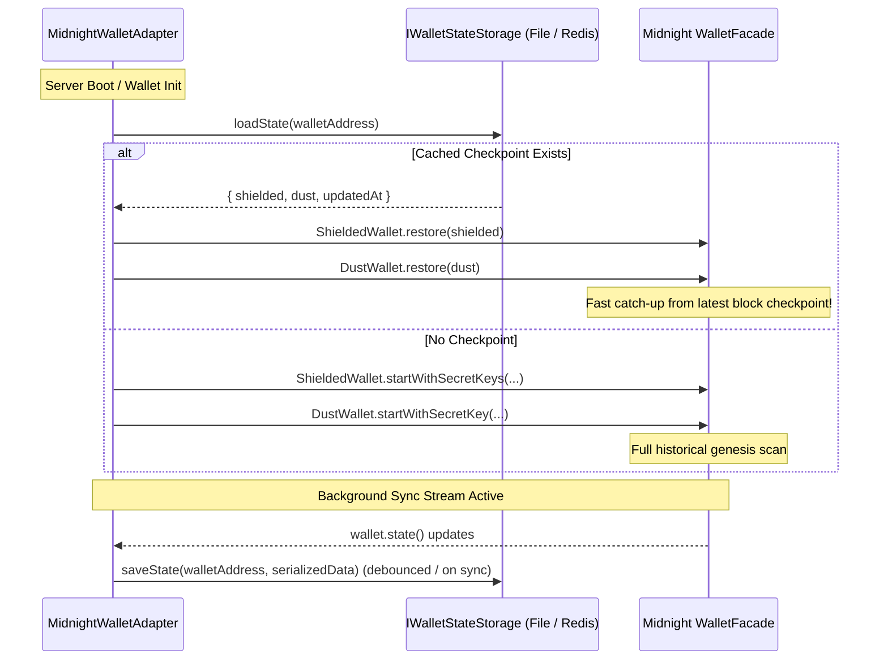

# Midnight Wallet Synchronization Guide & Persistent State Options

A comprehensive technical guide to understanding, accelerating, and monitoring Midnight wallet synchronization across the three sub-wallet state machines (**Unshielded**, **Shielded Zswap**, and **DUST Engine**).

---

## 1. Why Synchronization Takes Time (and Differences vs CLI)

There are three key factors determining synchronization performance:

### A. Tri-Wallet State Machine Convergence
In `@midnight-ntwrk/wallet-sdk`, `WalletFacade.isSynced` is only `true` when **all three sub-wallets** reach the chain tip:
1. **Unshielded Wallet** (`unshielded.progress.appliedId >= highestTransactionId`): Scans public transaction receipts and block headers.
2. **Shielded Wallet** (`shielded.progress.appliedId >= highestTransactionId`): Evaluates note commitments and nullifier trees.
3. **DUST Wallet** (`dust.progress.appliedId >= highestTransactionId`): Evaluates unshielded UTXO dust generation trees.

If any sub-wallet is catching up on historical blocks from genesis (0), `waitForSyncedState()` will wait until all 3 synchronize.

### B. Persistent WebSocket Lifecycle vs Request-Scoped Re-initialization
* **In CLI (`cli.ts`)**: A single long-lived Node.js process starts, establishes a persistent WebSocket connection to `wss://indexer.preprod.midnight.network/api/v4/graphql/ws`, and keeps the event loop active. Once it syncs, it stays synced.
* **In Web App (Next.js)**:
  * If a wallet instance is created on-demand inside an API route (or recreated when Next.js reloads modules), it must establish a new WebSocket handshake, subscribe to GraphQL topics, and query block checkpoints.
  * **Fix Implemented**: We attach the active wallet instance to `globalThis.__midnightWalletCache` in [`src/infrastructure/midnight/midnight-wallet.adapter.ts`](file:///home/paul/compact/hello-word/src/infrastructure/midnight/midnight-wallet.adapter.ts) so the wallet instance and WebSocket stream stay continuously active in the background.

### C. Synchronous HTTP Blocking
If an API route runs `await wallet.waitForSyncedState()`, the browser HTTP request waits 30–90 seconds before returning headers. Instead, our Clean Architecture pattern polls the non-blocking `wallet.state()` stream asynchronously via `/api/wallet/status`.

---

## 2. ⚡ Accelerating Synchronization with Persistent Serialized State Checkpoints

By default, initializing a wallet from seed starts scanning the chain from block 0 (genesis). To eliminate historical resync times on server restarts, the application implements **persistent serialized state caching**.

### How Serialized Checkpointing Works



1. **Check on Startup**: When `WalletFacade.init` is invoked, [`MidnightWalletAdapter`](file:///home/paul/compact/hello-word/src/infrastructure/midnight/midnight-wallet.adapter.ts) checks for an existing serialized checkpoint for the wallet address.
2. **Fast Restore**:
   - `ShieldedWallet(cfg).restore(savedState.shielded)`
   - `DustWallet(cfg).restore(savedState.dust)`
3. **Continuous Checkpointing**: The adapter subscribes to `wallet.state()` and periodically serializes and persists state checkpoints to disk/Redis (debounced every 15s and immediately upon 100% sync).

---

## 3. 🗄️ Persistence Storage Options (`file` vs `redis-json`)

You can choose where serialized wallet checkpoints (and contract deployments) are persisted via [`src/infrastructure/config/storage.config.ts`](file:///home/paul/compact/hello-word/src/infrastructure/config/storage.config.ts) or `.env.local`:

### Option 1: File Storage (`STORAGE_DRIVER=file`) — Default
* **Location**: `wallet-serialized-state.json` in the root workspace directory.
* **Mechanism**: Handled by [`FileWalletStateStorage`](file:///home/paul/compact/hello-word/src/infrastructure/persistence/file-wallet-state.storage.ts) with atomic JSON file persistence.
* **Prerequisites**: None (works out of the box).
* **Git Safe**: Automatically excluded in `.gitignore`.

### Option 2: RedisJSON (`STORAGE_DRIVER=redis-json`) — High Performance
* **Location**: Key `midnight:wallet:state:<walletAddress>` in Redis Stack.
* **Mechanism**: Handled by [`RedisWalletStateStorage`](file:///home/paul/compact/hello-word/src/infrastructure/persistence/redis/redis-wallet-state.storage.ts) using native RedisJSON documents (`JSON.SET` / `JSON.GET`).
* **Prerequisites**: Redis Stack Docker container (`npm run redis:start`).
* **Visual Inspection**: Explore and query active wallet checkpoints in the **RedisInsight UI** at [**http://localhost:8001**](http://localhost:8001).

### Migrating Between Storage Options
To copy all existing local file checkpoints into RedisJSON:
```bash
npm run migrate:redis
```

---

## 4. 🔍 Monitoring Live Synchronization Progress

The Midnight SDK exposes an active observable stream (`wallet.state()`) containing real-time progress metrics.

### Checking State Structure:
```typescript
import * as Rx from 'rxjs';

const state = await Rx.firstValueFrom(wallet.state());

// 1. Check WebSocket connection
console.log('Connected to Indexer:', state.unshielded.progress.isConnected);

// 2. Unshielded sub-wallet progress
console.log('Unshielded Applied ID:', state.unshielded.progress.appliedId);
console.log('Unshielded Highest ID:', state.unshielded.progress.highestTransactionId);

// 3. Shielded and Dust sub-wallet progress
console.log('Shielded Applied ID:', state.shielded.progress.appliedId);
console.log('Dust Applied ID    :', state.dust.progress.appliedId);

// 4. Overall synchronization flag
console.log('Is Fully Synced    :', state.isSynced);
```

### Streaming Real-Time Sync Logs in Code:
```typescript
wallet.state().subscribe((s) => {
  const applied = s.unshielded.progress.appliedId;
  const highest = s.unshielded.progress.highestTransactionId;
  const percent = highest > 0n ? Number((applied * 100n) / highest) : 0;
  
  console.log(`[Sync Progress] ${percent}% (${applied}/${highest}) - Synced: ${s.isSynced}`);
});
```

---

## 5. UI Features in the Next.js Application

1. **Persistent Global Cache**: Wallet instances survive Next.js module reloads and browser page reloads via `globalThis.__midnightWalletCache`.
2. **Live Sync Dashboard Modal**: Click the top sync badge to open the full diagnostic modal showing:
   * **Unshielded Progress**: `appliedId / highestTransactionId` (percentage bar).
   * **Shielded Zswap Progress**: Processed note tree index.
   * **DUST Engine Progress**: Processed UTXO registration trees.
   * **Real-time Ingestion Event Feed**: Live block event notifications and throughput rates (items/sec).
3. **Proving Guard & Warning Banners**:
   * ZK actions (such as *Prove & Store Message* and *Send tNIGHT*) display pulsating sync banners while catching up.
   * Action buttons are safely disabled when `!isSynced` to prevent submitting unbalanced proofs.